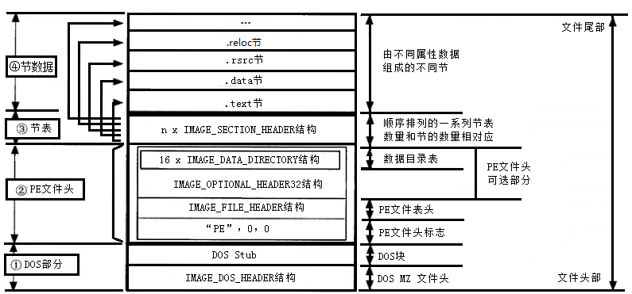

---
title: PE结构
date: 2019-09-15 17:15:56
tags: 可执行文件
---

1、PE文件的全称是Portable Executable，意为可移植的可执行的文件，常见的EXE、DLL、OCX、SYS、COM都是PE文件
2、可执行文件中的节：为了保证程序执行的安全，保证内核的稳定，Windows操作系统通常对不同用途的数据设置不同的权限。
比如：代码段中的字节码在程序运行的时候，一般不允许用户进行修改，数据段则允许在程序运行过程中读和写，常量只能读等。Windows操作系统在加载可执行程序时，会为这些具有不同属性的数据分别分配标记有不同属性的页面（当然，相同属性的数据可能会被放到同一个页面），以确保程序运行时的安全。
3、对齐：三类的对齐：数据在内存中的对齐、数据在文件中的对齐、资源文件中资源数据的对齐。
2.3.1. 内存对齐（SectionAligment）
PE 文件头里边的SectionAligment 定义了内存中区块的对齐值。由于Windows操作系统对内存属性的设置以页为单位，所以通常情况下，PE 文件被映射到内存中时，节在内存中的对齐单位必须至少是一个页的大小。对于32位的windows操作系统来说，这个值是4KB（1000h），而对64位操作系统来说，这个值就是8KB（2000h）。
2.3.2. 文件对齐（FileAligment）
PE 文件头里边的FileAligment 定义了磁盘区块的对齐值。每一个区块从对齐值的倍数的偏移位置开始存放。而区块的实际代码或数据的大小不一定刚好是这么多，所以在多余的地方一般以00h 来填充，这就是区块间的间隙。为了提高磁盘利用率，对齐单位通常小于内存，以一个物理扇区的大小作为对齐粒度，512字节，200h。
2.3.3. 资源数据对齐
资源字节码部分一般要求以双字（4字节）方式对齐。
4、PE文件结构被划分为四大部份，包括：DOS部分、PE头、节表、和节数据。

在应用程序中最常出现的段有以下6种：
执行代码段，通常 .text （Microsoft）或 CODE（Borland）命名；
数据段，通常以 .data
、.rdata 或 .bss（Microsoft）、DATA（Borland）命名；
资源段，通常以 .rsrc命名；
导出表，通常以 .edata命名；
导入表，通常以 .idata命名；
调试信息段，通常以 .debug命名；
参考[这里](https://blog.csdn.net/liuyez123/article/details/51281905)