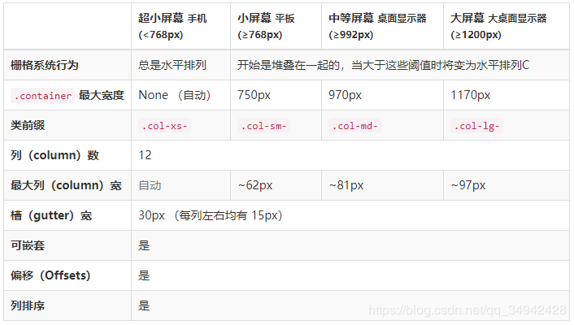

# bootstrap
## 入门模板
包括引入bootstrap中css和js库,以及jquery.js和popper.js，以及引导以移动优先的原响应标记
```
<!doctype html>
<html lang="en">
  <head>
    <!-- Required meta tags -->
    <meta charset="utf-8">
    <meta name="viewport" content="width=device-width, initial-scale=1, shrink-to-fit=no">

    <!-- Bootstrap CSS -->
    <link rel="stylesheet" href="https://stackpath.bootstrapcdn.com/bootstrap/4.3.1/css/bootstrap.min.css" integrity="sha384-ggOyR0iXCbMQv3Xipma34MD+dH/1fQ784/j6cY/iJTQUOhcWr7x9JvoRxT2MZw1T" crossorigin="anonymous">

    <title>Hello, world!</title>
  </head>
  <body>
    <h1>Hello, world!</h1>

    <!-- Optional JavaScript -->
    <!-- jQuery first, then Popper.js, then Bootstrap JS -->
    <script src="https://code.jquery.com/jquery-3.3.1.slim.min.js" integrity="sha384-q8i/X+965DzO0rT7abK41JStQIAqVgRVzpbzo5smXKp4YfRvH+8abtTE1Pi6jizo" crossorigin="anonymous"></script>
    <script src="https://cdnjs.cloudflare.com/ajax/libs/popper.js/1.14.7/umd/popper.min.js" integrity="sha384-UO2eT0CpHqdSJQ6hJty5KVphtPhzWj9WO1clHTMGa3JDZwrnQq4sF86dIHNDz0W1" crossorigin="anonymous"></script>
    <script src="https://stackpath.bootstrapcdn.com/bootstrap/4.3.1/js/bootstrap.min.js" integrity="sha384-JjSmVgyd0p3pXB1rRibZUAYoIIy6OrQ6VrjIEaFf/nJGzIxFDsf4x0xIM+B07jRM" crossorigin="anonymous"></script>
  </body>
</html>
```
## HTML5文件类型

```
<!DOCTYPE html>
<html lang="zh-CN">
  ...
</html>
```

```
<!doctype html>
<html lang="en">
  ...
</html>
```
## 响应式标记
保证移动设备优先优化代码，将下面代码添加到`<head>`中

```
<meta name="viewport" content="width=device-width, initial-scale=1, shrink-to-fit=no">
```
## 栅格系统
相应式、移动设备优先的流式栅格系统，随着屏幕的变化，系统会自动分为最多**12**列，每列类前缀的n加起来为12,当每行大于12时，会自动移动到下一行，**列中还可以嵌套行列**
行必须包含在容器`.container`（固定宽度）或`container-fluid`（100%宽度）中
列必须为行的直接子元素，所有的内容包含在列中，行标记`.row`,列标记有如下几种`breakpoint`如`xs`、`md`：
`.col-xs-n`、`.col-sm-n`、`.col-md-n`、`.col-lg-n`

## 媒体查询
在源sass(文件后缀为.scss，css预处理器，为了帮助物品们减少css代码的重复量)中为布局，栅格系统和组件提供媒体范围查询，`min-width`屏幕最低为n使用此样式，`max-width`屏幕最高为n时使用此样式
屏幕大时使用如下：
```
// Extra small devices (portrait phones, less than 576px)
// No media query for `xs` since this is the default in Bootstrap

// Small devices (landscape phones, 576px and up)
@media (min-width: 576px) { ... }

// Medium devices (tablets, 768px and up)
@media (min-width: 768px) { ... }

// Large devices (desktops, 992px and up)
@media (min-width: 992px) { ... }

// Extra large devices (large desktops, 1200px and up)
@media (min-width: 1200px) { ... }
```
屏幕小时使用如下：
```
// Extra small devices (portrait phones, less than 576px)
@media (max-width: 575.98px) { ... }

// Small devices (landscape phones, less than 768px)
@media (max-width: 767.98px) { ... }

// Medium devices (tablets, less than 992px)
@media (max-width: 991.98px) { ... }

// Large devices (desktops, less than 1200px)
@media (max-width: 1199.98px) { ... }

// Extra large devices (large desktops)
// No media query since the extra-large breakpoint has no upper bound on its width
```
通过sass mixins获得
`media-breakpoint-up`断点之上
```
@include media-breakpoint-up(sm) { ... }
@include media-breakpoint-up(md) { ... }
@include media-breakpoint-up(lg) { ... }
@include media-breakpoint-up(xl) { ... }
```
`media-breakpoint-down`断点之下：

```
@include media-breakpoint-down(xs) { ... }
@include media-breakpoint-down(sm) { ... }
@include media-breakpoint-down(md) { ... }
@include media-breakpoint-down(lg) { ... }
```
`media-breakpoint-only`等于断点：

```
@include media-breakpoint-only(xs) { ... }
@include media-breakpoint-only(sm) { ... }
@include media-breakpoint-only(md) { ... }
@include media-breakpoint-only(lg) { ... }
@include media-breakpoint-only(xl) { ... }
```

### 媒体查询实例
一、
```
<!DOCTYPE html>
<html lang="zh-CN">
<head>
    <meta charset="utf-8">
    <meta http-equiv="X-UA-Compatible" content="IE=edge">
    <meta name="viewport" content="width=device-width, initial-scale=1">
    <!-- 上述3个meta标签*必须*放在最前面，任何其他内容都*必须*跟随其后！ -->
    <title>Bootstrap 101 Template</title>

    <!-- Bootstrap -->
    <link href="https://cdn.jsdelivr.net/npm/bootstrap@3.3.7/dist/css/bootstrap.min.css" rel="stylesheet">

    <!-- HTML5 shim 和 Respond.js 是为了让 IE8 支持 HTML5 元素和媒体查询（media queries）功能 -->
    <!-- 警告：通过 file:// 协议（就是直接将 html 页面拖拽到浏览器中）访问页面时 Respond.js 不起作用 -->
    <!--[if lt IE 9]>
    <script src="https://cdn.jsdelivr.net/npm/html5shiv@3.7.3/dist/html5shiv.min.js"></script>
    <script src="https://cdn.jsdelivr.net/npm/respond.js@1.4.2/dest/respond.min.js"></script>
    <![endif]-->
    <style>
        @media (max-width: 575px) {
            .container {
                background-color: indianred;
                width: 144px;
                height: 144px;
            }
        }

        @media (min-width: 576px) {
            .container {
                background-color: #cccccc;
                width: 144px;
                height: 144px;
            }
        }

        @media (min-width: 768px) {
            .container {
                background-color: rebeccapurple;
                width: 192px;
                height: 192px;
            }
        }

        @media (min-width: 992px) {
            .container {
                background-color: chartreuse;
                width: 248px;
                height: 248px;
            }
        }

        @media (min-width: 1200px) {
            .container {
                background-color: darkslategrey;
                width: 300px;
                height: 300px;
            }
        }
    </style>
</head>
<body>
<div class="container">
    <div class="row">
        <div class="col-sm">
            <p class="text-danger">One of three columns</p>
        </div>
        <div class="col-sm">
            One of three columns
        </div>
        <div class="col-sm">
            One of three columns
        </div>
    </div>
</div>

<!-- jQuery (Bootstrap 的所有 JavaScript 插件都依赖 jQuery，所以必须放在前边) -->
<script src="https://cdn.jsdelivr.net/npm/jquery@1.12.4/dist/jquery.min.js"></script>
<!-- 加载 Bootstrap 的所有 JavaScript 插件。你也可以根据需要只加载单个插件。 -->
<script src="https://cdn.jsdelivr.net/npm/bootstrap@3.3.7/dist/js/bootstrap.min.js"></script>
</body>
</html>
```
### 栅格布局
1、设置一列宽度，其他列设置为`col`，可以自动调整列宽
2、可变宽度内容，使用`col-{breakpoint}-auto`可以根据其内容宽度来调整列的大小
3、插入`.w-100`可以实现跨多行等宽列

```
<div class="container-fluid">
    <div class="row">
        <div class="col" style="background-color: darkseagreen">1</div>
        <div class="col" style="background-color: forestgreen">1</div>
        <div class="col" style="background-color: indianred">1</div>
        <div class="w-100"></div>
        <div class="col" style="background-color: darkseagreen">1</div>
        <div class="col" style="background-color: forestgreen">1</div>
        <div class="col" style="background-color: indianred">1</div>
    </div>
```
4、根据不同的屏幕尺寸，采用不同的方案

```
<div class="container">
  <!-- Stack the columns on mobile by making one full-width and the other half-width -->
  <div class="row">
    <div class="col-12 col-md-8">.col-12 .col-md-8</div>
    <div class="col-6 col-md-4">.col-6 .col-md-4</div>
  </div>

  <!-- Columns start at 50% wide on mobile and bump up to 33.3% wide on desktop -->
  <div class="row">
    <div class="col-6 col-md-4">.col-6 .col-md-4</div>
    <div class="col-6 col-md-4">.col-6 .col-md-4</div>
    <div class="col-6 col-md-4">.col-6 .col-md-4</div>
  </div>

  <!-- Columns are always 50% wide, on mobile and desktop -->
  <div class="row">
    <div class="col-6">.col-6</div>
    <div class="col-6">.col-6</div>
  </div>
</div>
```
## 对齐
### 水平对齐
行的垂直对齐：**行对齐**
使用align
```
<div class="container">
  <div class="row align-items-start">
    <div class="col">
      One of three columns
    </div>
    <div class="col">
      One of three columns
    </div>
    <div class="col">
      One of three columns
    </div>
  </div>
  <div class="row align-items-center">
    <div class="col">
      One of three columns
    </div>
    <div class="col">
      One of three columns
    </div>
    <div class="col">
      One of three columns
    </div>
  </div>
  <div class="row align-items-end">
    <div class="col">
      One of three columns
    </div>
    <div class="col">
      One of three columns
    </div>
    <div class="col">
      One of three columns
    </div>
  </div>
</div>
```
列的垂直对齐：**列对齐**

```
<div class="container">
    <div class="row">
        <div class="col align-self-start">
            One of three columns
        </div>
        <div class="col align-self-center">
            One of three columns
        </div>
        <div class="col align-self-center">
            One of three columns
        </div>
        <div class="col align-self-end">
            One of three columns
        </div>
    </div>
</div>
```
### 垂直对齐
使用justify
```
<div class="container">
    <div class="row justify-content-start">
        <div class="col-4">one</div>
        <div class="col-4">one</div>
    </div>
    <div class="row justify-content-center">
        <div class="col-4">one</div>
        <div class="col-4">one</div>
    </div>
    <div class="row justify-content-end">
        <div class="col-4">one</div>
        <div class="col-4">one</div>
    </div>
</div>
```
### 排序
使用`.order-`classes来对元素进行排序，当所有元素都进行排序，或者未进行排序的元素在前面时，可以使用`.order-n`n的取值范围为1-12

```
<div class="container">
  <div class="row">
    <div class="col">
      First, but unordered
    </div>
    <div class="col order-12">
      Second, but last
    </div>
    <div class="col order-1">
      Third, but first
    </div>
  </div>
</div>
```
当有元素未进行排序，且元素处于中间时，可以采用`.order-last`等价于`order: -1`和`.order-last`等价于`order: 13`将元素排在最前和最后

```
<div class="container">
  <div class="row">
    <div class="col order-last">
      First, but last
    </div>
    <div class="col">
      Second, but unordered
    </div>
    <div class="col order-first">
      Third, but first
    </div>
  </div>
</div>
```
### 偏移
使用`.offest-md-*`来将类向右移动，增加左边距

```
<div class="container">
  <div class="row">
    <div class="col-md-4">.col-md-4</div>
    <div class="col-md-4 offset-md-4">.col-md-4 .offset-md-4</div>
 </div>
```
### 嵌套
**每一列可以嵌套其他的行列**
```
<div class="container">
  <div class="row">
    <div class="col-sm-9">
      Level 1: .col-sm-9
      <div class="row">
        <div class="col-8 col-sm-6">
          Level 2: .col-8 .col-sm-6
        </div>
        <div class="col-4 col-sm-6">
          Level 2: .col-4 .col-sm-6
        </div>
      </div>
    </div>
  </div>
</div>
```
## SASS mixins
通过预定义css和mixin来创建自定义、响应式布局，可以达到重用代码的目的
1、安装sass

```
npm install sass
```
2、编译sass成css，引入html文件

```
sass test.scss test.css
```

```
<link rel="stylesheet" href="test.css" type="text/css">
```
3、使用mixin
mixin时定义的一组css声明，可以传入参数，只需声明一次，可以在文件中不限次数的引用。
创建mixin声明，使用@mixin指令：

```
@mixin mixin-name() {
    /* css 声明 */
}
```
引用mixin指令：
```
@include mixin-name();
```
调用代码，注意顺序，mixin定义的代码需要在调用**之前**
```
@mixin define-style($background,$color){
     background-color:$background;
     color:$color
}
.col{
        @include define-style(darkseagreen,white)
}


```
## box-sizing属性
早版本的box:宽度或高度+填充(padding)+边框=实际写的宽度和高度
border-box:

```
*, *:before, *:after {
            box-sizing:border-box;
        }
<div class="x">
     fwsfwe
</div>
```

实际的宽度和高度与边框和填充无关
content-box:
```
*, *:before, *:after {
            box-sizing: content-box;
        }
<div class="x">
     fwsfwe
</div>
```

