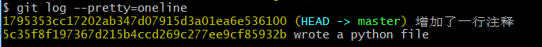
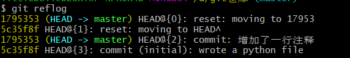
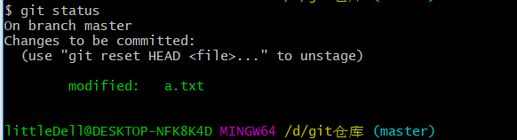
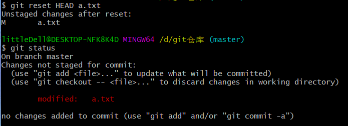

# 初识git
版本库又名仓库，英文名repository，你可以简单理解成一个目录，这个目录里面的所有文件都可以被Git管理起来，每个文件的修改、删除，Git都能跟踪，以便任何时刻都可以追踪历史，或者在将来某个时刻可以“还原”。
1、创建空的仓库

```
git init
```
2、像仓库中添加文件

```
git add xxx.py
```

3、向仓库提交

```
git commit -m "本次提交的说明"
```

```
1 file changed, 76 insertions(+)
```
此结果是指1个文件被修改，插入了76条语句
add可以多次，然后用commit可以一起提交
4、查看当前仓库的状态

```
git status
```
5、查看文件修改内容

```
git diff 
```
后面可以加具体你想看哪个文件的修改
6、查看多次提交的日志

```
git log
```
想看到关键信息可以加`--pretty=oneline`
7、版本回退
`HEAD`每次指向当前版本，上一个版本是`HEAD^`，上上个版本是`HEAD^^`,前100个版本`HEAD~100`
例如我们回到上一个版本，

```
git reset --hard HEAD^
```
然后我们看到了这个结果：

```
HEAD is now at 5c35f8f wrote a python file
```
版本已经回退到了wrote a python file的版本，再次查看log我们会发现，我们回退之前的版本已经没有了，如果我们还想要再次回到之前的版本，我们可以往上翻，找到之前的版本号，如下图，就是17953.....内个

使用命令`git reset --hard 17953`只要能够保证版本号不重，不用将所有号都协商，只要保证前几位不相同，能找到就行，emmmmm...执行完就回到之前了
如果已经关闭页面，可以用`git reflog`

前面黄色的部分就是版本号，我们还可以找到以前的版本号为1795353，然后继续使用`git reset`恢复版本号
8、工作区和暂存区
Git的版本库里存了很多东西，其中最重要的就是称为stage（或者叫index）的暂存区，还有Git为我们自动创建的第一个分支master，以及指向master的一个指针叫HEAD。
我们修改文件的时候是处于工作区的，当我们将修改的文件add后，修改的文件会存入暂存区，当我们commit之后，会将暂存区的文件放到master分支下，提交完成。
9、撤销修改
**撤销修改**，无论是在工作区的修改，还是add之后的修改。
```
git checkout -- file
```
这里有两种情况：
一种是readme.txt自修改后还没有被放到暂存区，现在，撤销修改就回到和版本库一模一样的状态；
一种是readme.txt已经添加到暂存区后，又作了修改，现在，撤销修改就回到添加到暂存区后的状态。
总之，就是让这个文件回到最近一次git commit或git add时的状态。
**撤销add**

```
git reset HEAD <file>
```
可以将文件退回到工作区。
然后就是操作的**例子**：
修改文件后add,查看状态

显示修改等待等待被提交，然后就按上面说的通过'git reset'退回到工作区，--表示操作当前分支

退回工作区之后，最后一步，撤销修改

好喽，回到解放前喽。。。撤销完成。。。
10、删除文件
当文件在工作区，还没提交时，直接用`rm file`删除，如果文件已经提交可以使用`git rm file`再`git commit -m "描述"`提交