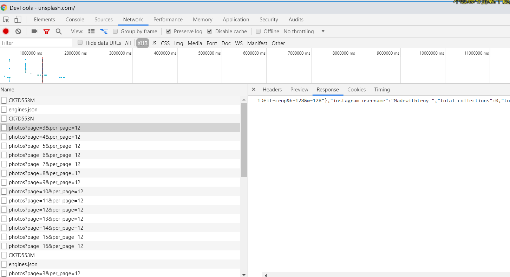

---
title: unsplash 网站爬虫抓取壁纸
date: 2019-08-02 15:24:54
tags:
---
# unsplash网站爬虫爬取壁纸
进入网站，F12查看元素，下滑网页发现网页加载时通过改变请求的页数来加载图片，查看response会看到返回的json数据，其中"urls"中的"raw"应该就是原图了，通过json解析拿到url之后再通过requests发起请求，通过open函数，以"wb"形式打开，将返回的图片数据的二进制写入文件中，为了加快爬取速度，我们可以通过多进程来加快爬取速度。

```
from bs4 import BeautifulSoup
import requests,sys,json
from urllib.parse import urlencode
from requests.exceptions import RequestException
from multiprocessing import Pool

# 获取html网页
def get_page(url):
    headers={
        "user-agent":"Mozilla/5.0 (Windows NT 10.0; Win64; x64) AppleWebKit/537.36 (KHTML, like Gecko) Chrome/75.0.3770.142 Safari/537.36",
        "cookie":"ugid=e8439e3ca8fe8955010c6f91ad049a375215476; _ga=GA1.2.1726177375.1564642854; _gid=GA1.2.1026129296.1564642854; uuid=1b327af0-b42a-11e9-a734-5ff3d1c081cf; xpos=%7B%7D; lux_uid=156471487830225985; _sp_ses.0295=*; _sp_id.0295=2652b46e-8ba7-4ac0-a52e-6cc037820195.1564642855.3.1564715120.1564648476.f8d0e8ce-9e42-4303-8eb4-022a8927248c"
    }
    try:
        html=requests.get(url,headers=headers)
        if(html.status_code==200):
            return html.text
        else:
            print(html.status_code)
            return None
    except requests.RequestException:
        print("出现请求异常")
        return None
#解析html网页，并保存数据
def main(n):
    img=[]
    name=[]
    data={
        "page":n,
        "per_page":12
    }
    #拼接get请求的参数
    url="https://unsplash.com/napi/photos?"+urlencode(data)
    html=get_page(url)
    #拿到网页中的json数据
    contents=json.loads(html)
    if contents:
        for i in range(len(contents)):
            #解析json数据，拿到图片url，并以id作为名称
            img.append(contents[i].get("urls").get("raw"))
            name.append(contents[i].get("id"))
    for i in range(len(img)):
        img_position="D:\精美壁纸\%s.jpg"%(name[i])
        with open(img_position,"wb") as f:
            imgcontent=requests.get(img[i])
            f.write(imgcontent.content)
            print("下载成功")
            f.close()


if __name__ == "__main__":
    pool=Pool()
    #开启多进程爬取数据
    pool.map(main,[x for x in range(3,30)])
```

