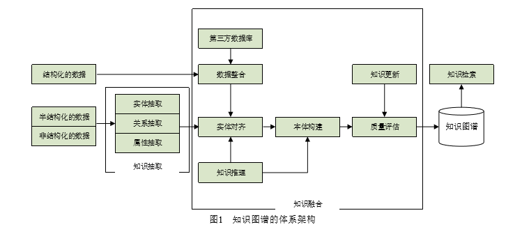

# 知识图谱
## 知识图谱的产生
由于万维网上的内容多源异质，结构松散，为了使知识结构化，从之前的语义网络发展成现在的知识图谱。
## 知识图谱体系架构
1、自顶向下：
先为知识图谱定义好本体与数据模式，再将实体加入到知识库，需要利用现有结构化知识库作为基础知识库。
2、自底向上：
从开放链接数据中提取出实体，并选择可信度高的加入到知识库，再构建本体模式。

## 知识图谱关键技术
1、知识抽取
主要的知识单元包含实体、关系、属性三个要素。
实体抽取：又称命名实体识别，从原始语料中自动识别出命名实体。
知识抽取评价指标：

```
精确率（precision）：正确识别或分类的样本数/被识别的或分类的总数
召回率(recall)：所有被识别或分类出的样本数/总的应该被识别出的样本数
Retrieved：正确的，相关的
Retrieved：被检测出的，被识别的
```
|  |  Retrieved | NonRelevant |
|--|--|--|
|Retrieved  |  true positives （tp）|false positives（fp）
|Not Retrieved  |  false negatives（fn）|true negatives （tn）

```
P=TP/(TP+FP)
R=TP/(TP+FN)
```
实体抽取的方法：基于规则和词典的方法、基于统计机器学习的方法、面向开放域的方法。
2、关系抽取
为了解决实体间语义链接的问题